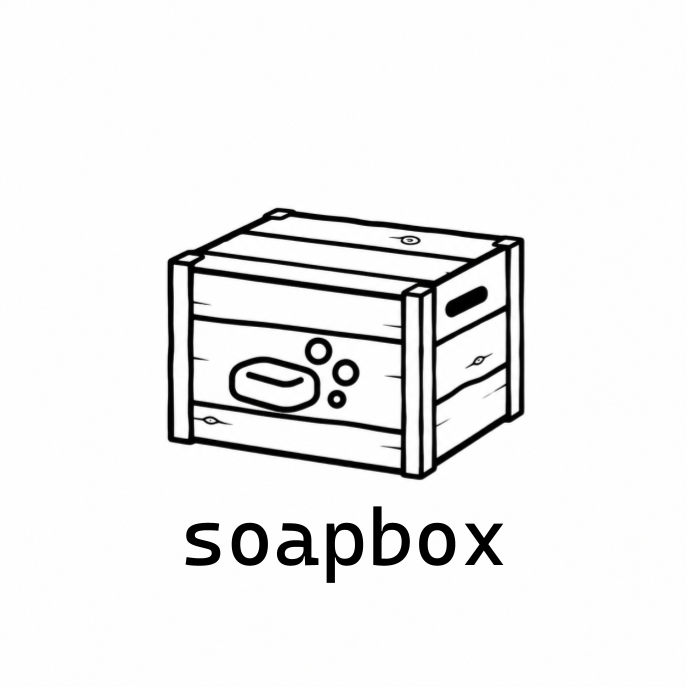

# Soapbox

Soapbox is a self-hosted, single-author blogging application built with Ruby on Rails. It gives one person a simple way to publish writing on the web, manage subscribers, and send posts to readers by email.

It is intentionally narrow in scope: one publication, one owner, and infrastructure you run yourself.

Soapbox is still in active development.

## Documentation

For setup, deployment, author guidance, and architecture documentation, see:

https://docs.mgove.dev/2/soapbox
