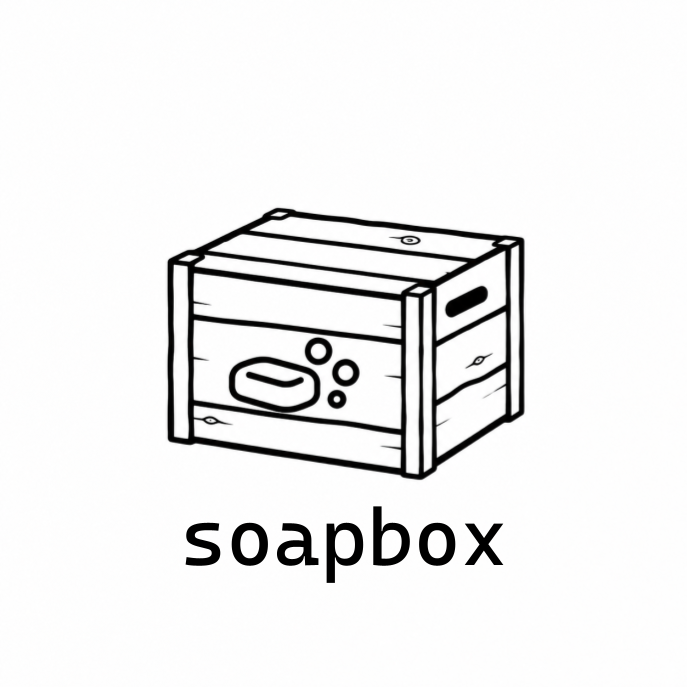

# Soapbox

Soapbox is a self-hosted, single-author blogging application built with Ruby on Rails. Publish your writing on the web, let readers subscribe to it, and send them new content via email&mdash;all in an app you run yourself.

## Status

Soapbox is very much a work in progress. If you run Soapbox, plan to follow the repository closely.

## Running Your Own Copy

Soapbox is distributed as a complete Rails application through a [GitHub template repository](https://github.com/maxwellkg/soapbox). To run your own site, create a repository from that template, clone it, configure it for your domain, and deploy it yourself.

The application ships ready to deploy with [Kamal](https://kamal-deploy.org/). Update these settings before deploying:

- **Deployment** — Define the server address, the domain and SSL proxy settings, the container registry, and the storage volume in `config/deploy.yml`.
- **Production URL** — Uncomment and add your domain to `default_url_options` in `config/environments/production.rb` so that links can be generated correctly in your emailed content
- **Email delivery** — Add your Postmark API token to the Rails encrypted credentials under `postmark_api_token` via `EDITOR=[your editor] bin/rails credentials:edit`. Update the sender address in the `default from:` in `app/mailers/application_mailer.rb`.

Until you run the setup process, visitors will see a "nothing is here yet" page. Run `bin/kamal site_setup` (`bin/rails site:setup` in a development environment) to create the site's author and blog records. Afterwards, you can add a rich-text description of the blog, a site image, and other configuration in the admin area.

## Documentation

For detailed setup, deployment, first-time setup, and author guidance, see the full documentation: https://docs.mgove.dev/2/soapbox

## License

Soapbox is licensed under the MIT License. See [LICENSE](LICENSE) for the full terms.
