# Soapbox User Guide

Soapbox is a small, self-hosted blog for a single author. This guide is written for that author: the person who sets the blog up, signs into the admin area, writes posts, and manages subscribers.

Most of Soapbox is intentionally simple. The public site is minimal and easy to navigate, while the admin area gives you a small set of focused tools for running the blog. This guide explains those tools in plain language, with just enough setup detail to get a fresh installation ready for use.

## Before You Start

Most day-to-day work in Soapbox happens in the admin area at `/admin`. That is where you manage the blog's identity, write and publish posts, and review or update subscribers.

On a fresh install, Soapbox is not ready to serve a normal blog until its required `Blog` and `Author` records have been created. Until setup is complete, visitors will see `there's nothing here yet`. That is expected.

## First-Time Setup

Before launching Soapbox in production, set its canonical URL in `config/environments/production.rb`:

```ruby
default_url_options = { host: "blog.example.com", protocol: "https" }
config.action_mailer.default_url_options = default_url_options
routes.default_url_options = default_url_options
```

In the same file, enable SSL:

```ruby
config.force_ssl = true
```

If SSL is terminated by a reverse proxy, which is common when deploying with Kamal and a proxy in front of the app, also enable:

```ruby
config.assume_ssl = true
```

Set the sender address in `app/mailers/application_mailer.rb`:

```ruby
default from: "updates@blog.example.com"
```

That `from` address controls sender identity, but it does not configure delivery by itself. You still need working Action Mailer delivery settings in production, such as SMTP credentials in your production credentials or environment-specific configuration.

Once the app is configured and the database exists, run:

```sh
bin/rails site:setup
```

This task creates the required author and blog records. It will ask for the basic information needed to get the site into a usable state.

One detail is intentionally left for later: the blog description is rich text, so it is not collected in the terminal setup flow. After setup is complete, sign in to the admin area and add that description there.

## Signing In

After setup, go to `/admin`. If you are not already signed in, Soapbox will direct you through the sign-in flow and then return you to the admin area.

The admin area is the control center for the blog. From there, you can move between blog settings, posts, and subscribers.

## What Readers See

The public site is intentionally straightforward. It gives readers a clean list of posts, a way to open any individual post, and a simple email signup form.

On the homepage, readers see the blog title, any configured subtitle and description, and a list of posts with previews. The signup form appears near the top of the page so readers can subscribe without hunting for it.

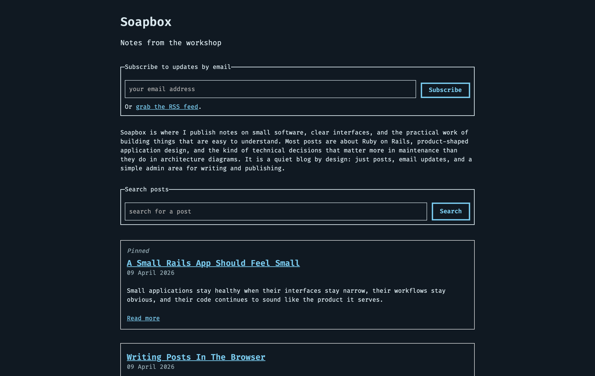

Path: `/`

Each post page shows the full post content for a single entry. The signup form appears there as well, so a reader who discovers the site through one post can still subscribe easily.

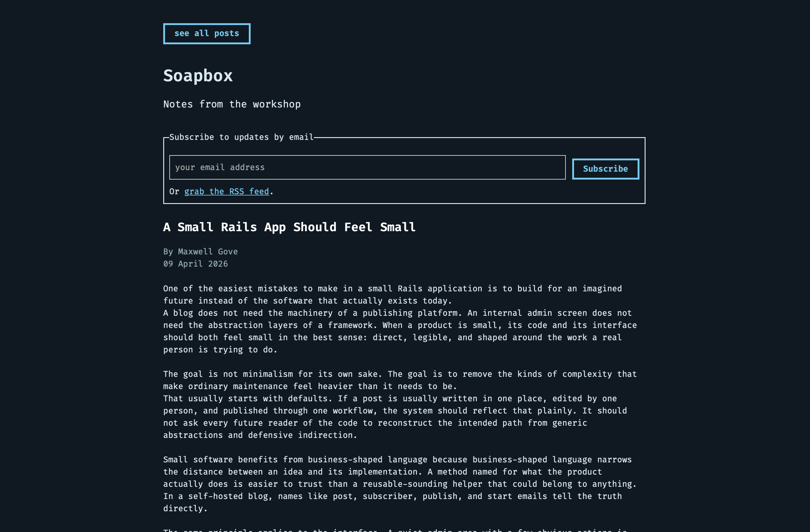

Path: `/posts/:slug`

## The Admin Home Page

The admin home page is the starting point for managing the blog. From here, you can:

- go back to the public blog
- manage your account
- manage the blog itself
- manage posts
- manage subscribers

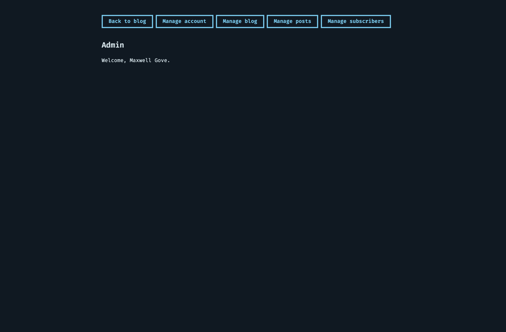

Path: `/admin`

## Managing Blog Settings

The blog settings area controls the publication's identity.

The title is the main name of the publication. The subtitle adds a short secondary line when you want one. The description gives you a richer introduction on the public homepage and supports rich text, so it can be more expressive than a plain text tagline.

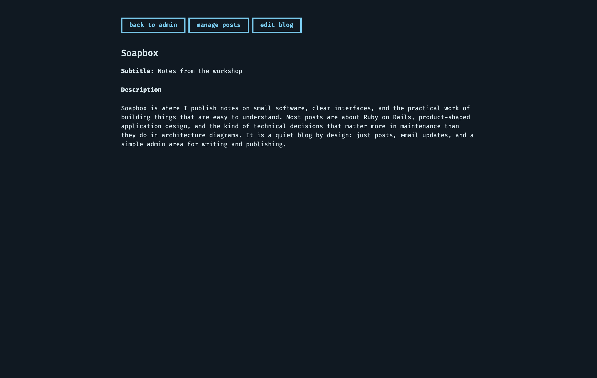

Path: `/admin/blog`

You can set or update the blog title, subtitle, and description by editing the blog. This is also where you finish part of the setup that `bin/rails site:setup` cannot complete. Because the description is rich text, it is edited here in the browser instead of being collected in the terminal.

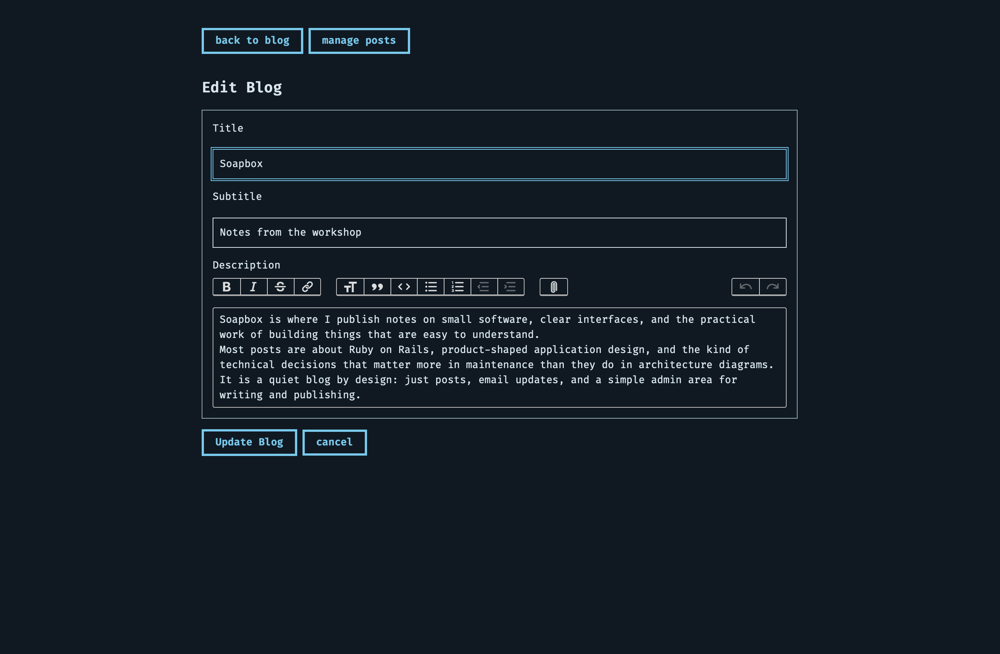

Path: `/admin/blog/edit`

## Managing Posts

Posts are at the center of the application. The posts index shows your existing posts, their status, and when they were last updated. If you already have a library of writing, you can also search from this page.

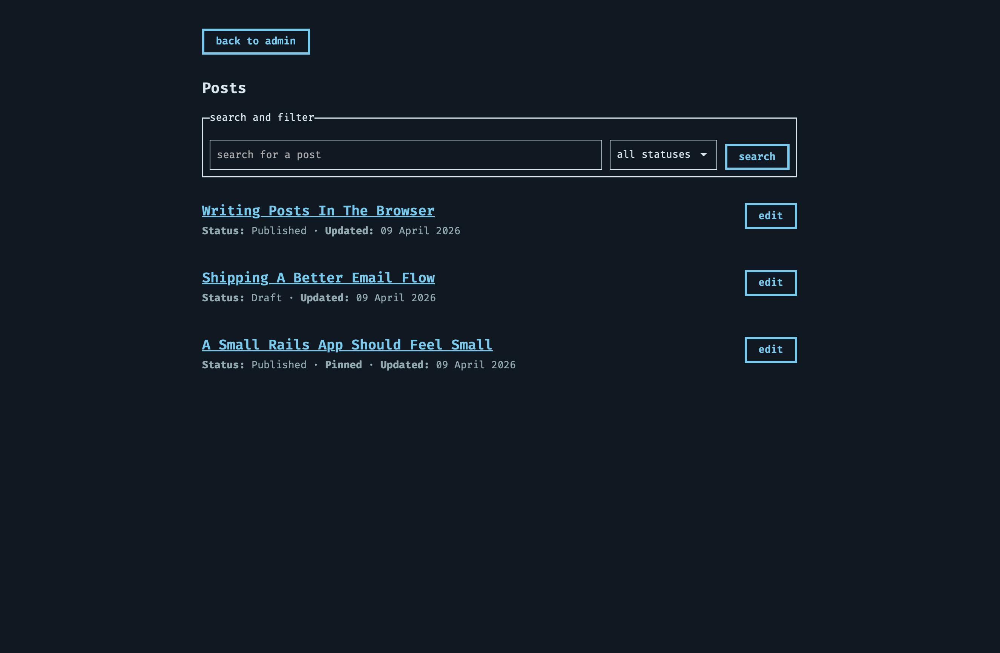

Path: `/admin/posts`

Creating a post begins with a small form:

- `title` is the post title readers will see
- `slug` is the URL path for the post (on a new post, the slug will automatically be set from the title if it is not specifically given)
- `pinned` lets you keep an important post prominent; pinned posts appear first in the list of posts on the home page of the public blog
- `summary` is an optional, shorter preview used in listings; posts without a given summary will be summarized using the first 80 words of their content
- `content` is the full post body

New posts begin as drafts. That gives you room to write, revise, and preview your work before making it public.

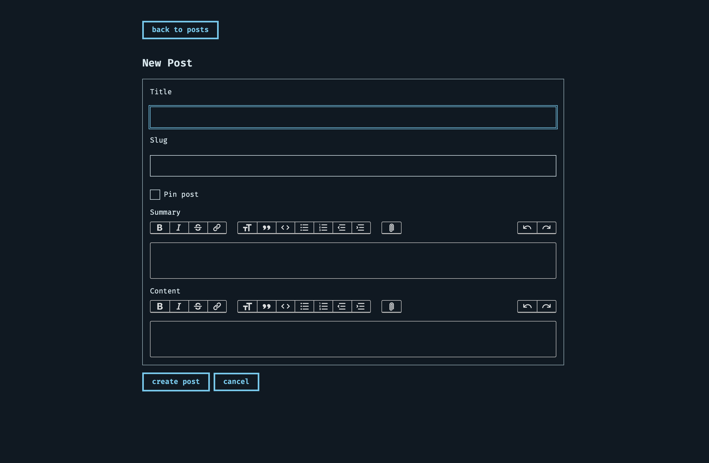

Path: `/admin/posts/new`


## Reviewing A Post

Each post has a detail page in the admin area where you can review the post.

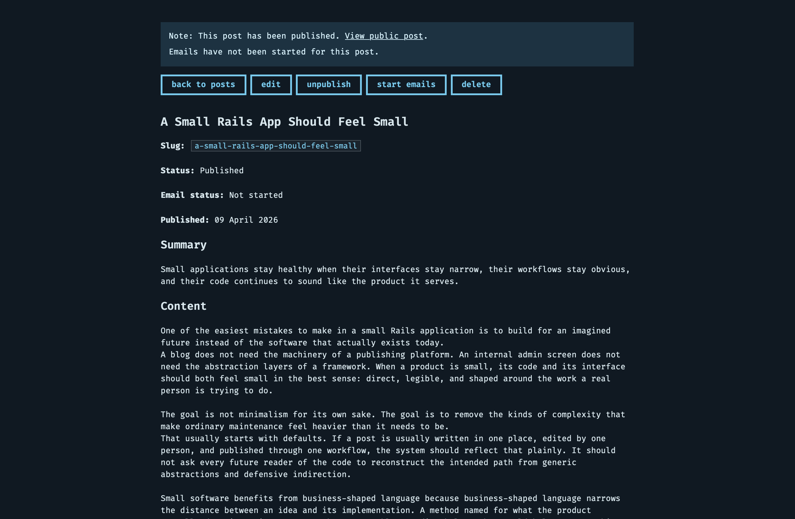

Path: `/admin/posts/:slug`

## Publishing And Emailing Posts

The post detail page also acts as the post's control center. You can view and change the post's publishing status and email status.

Soapbox treats publication and email delivery as related but separate decisions.

Publishing a post makes it visible on the public site. Unpublishing removes it from public view. This lets you control when a post appears on the blog itself.

Email delivery is a separate step. A post must be published before emails can begin, but publishing alone does not automatically send anything. This separation makes it less likely for email delivery (which is irreversible) to accidentally be performed prematurely.

When you start emails for a post, Soapbox moves the post into a pending email state. This pending state will last about one minute. While the post is pending, email delivery can still be stopped and the email status will return to `not started`. Once delivery has been initiated, that status is preserved as part of the post's history.

## Managing Subscribers

The subscribers area shows the people who have signed up to receive your posts by email. The subscribers index shows each subscriber's email address, current status, and last update time. If you need to find someone quickly, you can search by email address. This page is also the starting point for adding someone manually.

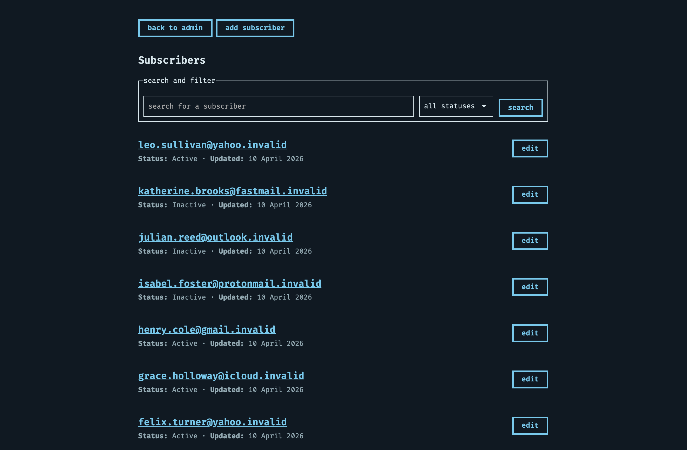

Path: `/admin/subscribers`

If you choose `add subscriber`, Soapbox takes you to a small form that asks only for the subscriber's email address. New subscribers created from the admin area are activated as part of creation.

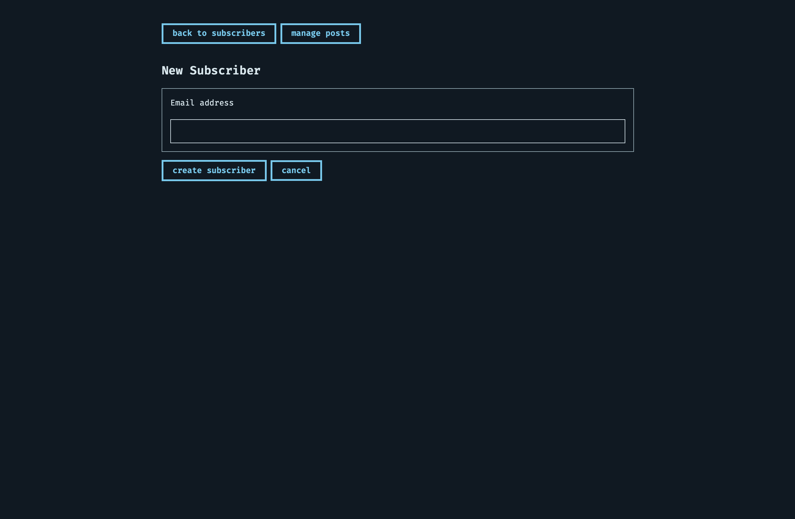

Path: `/admin/subscribers/new`

Each subscriber has a detail page where you can review their current status and take action.

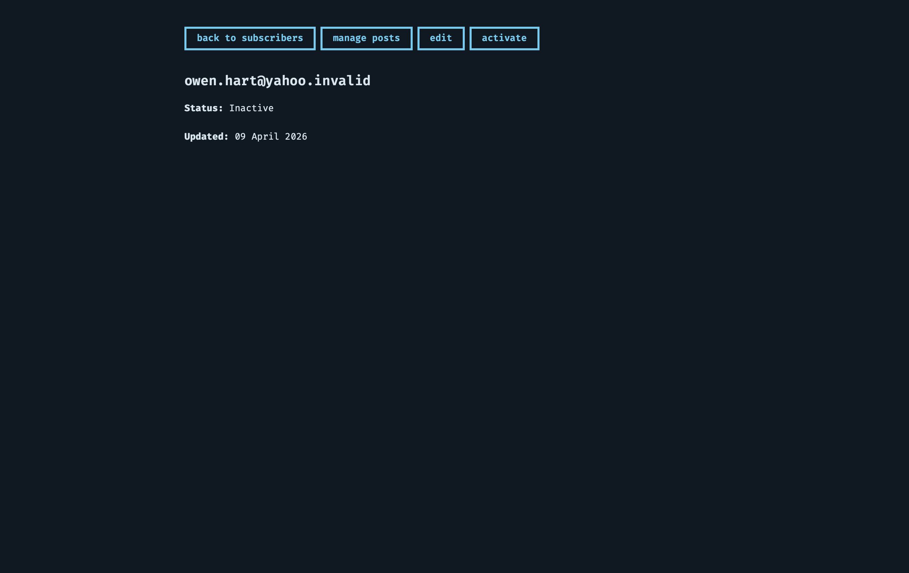

Path: `/admin/subscribers/:id`

Subscribers can be activated or deactivated. In practical terms, that controls whether the subscriber is currently part of the mailing list.

If you need to correct or update an address, the subscriber's edit page gives you a direct way to change it without leaving the admin workflow.

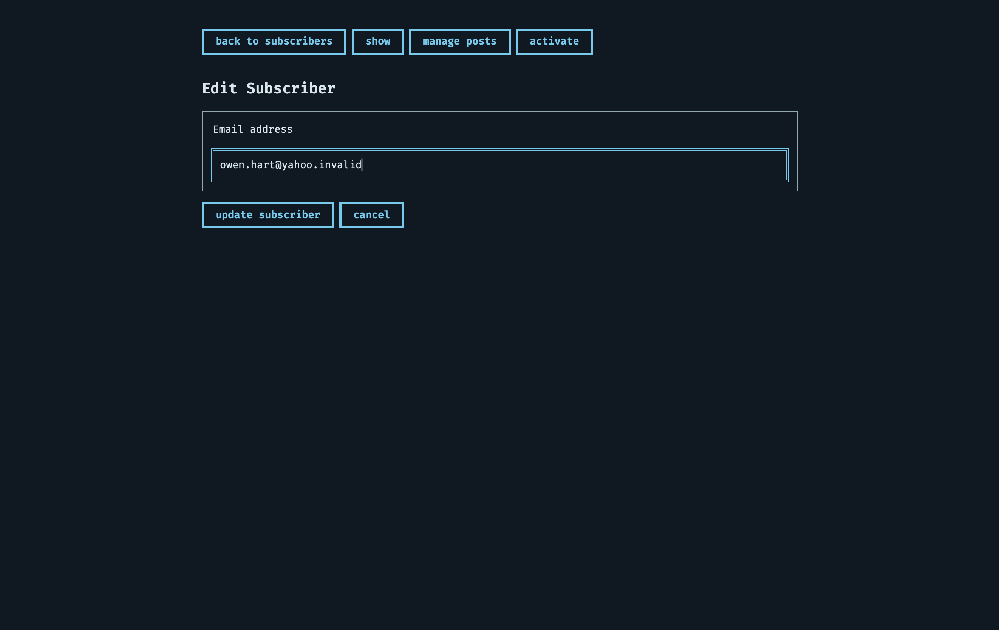

Path: `/admin/subscribers/:id/edit`
